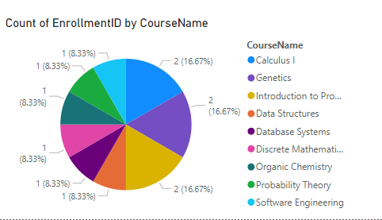
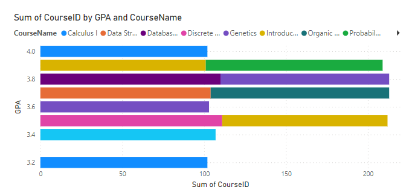
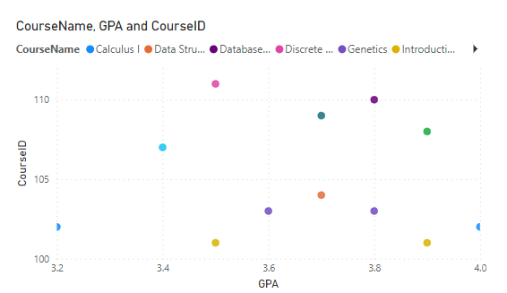

<h1 align="center"> University DB</h1>

This is a readme file for a university db consturcted using 
<a href="https://www.microsoft.com/en-us/sql-server/sql-server-downloads" target="blank">
SQL Server</a>
and <a href="https://learn.microsoft.com/en-us/sql/ssms/download-sql-server-management-studio-ssms?view=sql-server-ver16" target="blank">
SSMS</a>

## 1. Database Creation or Restoration

#### Creating new DB:
```sql
CREATE DATABASE UniversityDB;
```
#### Creating tables and their columns

```sql
CREATE TABLE Departments (
    DepartmentID INT PRIMARY KEY,
    DepartmentName VARCHAR(100)
);
CREATE TABLE Students (
    StudentID INT PRIMARY KEY,
    FirstName VARCHAR(50),
    LastName VARCHAR(50),
    DepartmentID INT,
    GPA DECIMAL(3, 2),
    FOREIGN KEY (DepartmentID) REFERENCES Departments(DepartmentID)
);
CREATE TABLE Courses (
    CourseID INT PRIMARY KEY,
    CourseName VARCHAR(100),
    DepartmentID INT,
    FOREIGN KEY (DepartmentID) REFERENCES Departments(DepartmentID)
);

CREATE TABLE Enrollment (
    EnrollmentID INT PRIMARY KEY,
    StudentID INT,
    CourseID INT,
    AcademicYear INT,
    Grade VARCHAR(2),
    FOREIGN KEY (StudentID) REFERENCES Students(StudentID),
    FOREIGN KEY (CourseID) REFERENCES Courses(CourseID)
);
```
#### Adding rows
```sql
INSERT INTO Departments (DepartmentID, DepartmentName)
VALUES
    (1, 'Computer Science'),
    (2, 'Mathematics'),
    (3, 'Biology');
    

INSERT INTO Students (StudentID, FirstName, LastName, DepartmentID, GPA)
VALUES

    (1, 'John', 'Doe', 1, 3.5),
    (2, 'Jane', 'Smith', 2, 3.2),
    (3, 'Robert', 'Johnson', 3, 3.8),
    (4, 'Emily', 'Williams', 1, 3.9),
    (5, 'Michael', 'Brown', 1, 3.7),
	(6, 'Sarah', 'Johnson', 3, 3.6),
    (7, 'David', 'Smith', 1, 3.4),
    (8, 'Jennifer', 'Lee', 2, 3.9),
	(9, 'Michael', 'Johnson', 3, 3.7),
    (10, 'Emily', 'Davis', 2, 3.5),
    (11, 'Daniel', 'Wilson', 2, 4.0),
    (12, 'Jessica', 'Anderson', 1, 3.8);

INSERT INTO Courses (CourseID, CourseName, DepartmentID)
VALUES
     (101, 'Introduction to Programming', 1),
    (102, 'Calculus I', 2),
    (103, 'Genetics', 3),
	(104, 'Data Structures', 1),
    (105, 'Linear Algebra', 2),
	(106, 'Cell Biology', 3),
    (107, 'Software Engineering', 1),
    (108, 'Probability Theory', 2) ,
	(109, 'Organic Chemistry', 3),
    (110, 'Database Systems', 1),
    (111, 'Discrete Mathematics', 2);


INSERT INTO Enrollment (EnrollmentID, StudentID, CourseID, AcademicYear, Grade)
VALUES
    (1, 1, 101, 2022, 'A'),
    (2, 2, 102, 2022, 'B'),
    (3, 3, 103, 2022, 'A'),
    (4, 4, 101, 2023, 'C'),
    (5, 5, 104, 2022, 'A'),
	(6, 6, 103, 2023, 'B'),
    (7, 7, 107, 2021, 'C'),
    (8, 8, 108, 2020, 'B'),
	(9, 9, 109, 2020, 'A'),
	(10, 10, 111, 2021, 'B'),
	(11, 11, 102, 2023, 'A'),
	(12, 12, 110, 2022, 'B');
```

#### Make a Bakup file and Restoring Script

- write click your db
- select Backup
- choose your destination and click ok

- for the restoring script:
    ```sql
    RESTORE DATABASE UniversityDB
    FROM DISK = 'E:\College\LSDB\final_proj\uni_db.bak';
    ```


## Data Analysis
 - Count of students by Department:
 ```sql
 SELECT DepartmentName, COUNT(StudentID) AS StudentCount
FROM Students
JOIN Departments ON Students.DepartmentID = Departments.DepartmentID
GROUP BY DepartmentName;
 ```

 - Total Enrollment by Year:
 ```sql
 SELECT AcademicYear, COUNT(EnrollmentID) AS TotalEnrollment
FROM Enrollment
GROUP BY AcademicYear;
 ```

- Average GPA by Course:
```sql
SELECT CourseID, AVG(GPA) AS AverageGPA
FROM Enrollment
JOIN Students ON Enrollment.StudentID = Students.StudentID
GROUP BY CourseID;
```

## Query(Breakdown, Rollup, Cube)

- Breakdown by Department:
```sql
SELECT
    DepartmentName,
    COUNT(s.StudentID) AS EnrollmentCount
FROM
    Departments d
LEFT JOIN
    Students s ON d.DepartmentID = s.DepartmentID
GROUP BY
    d.DepartmentID, d.DepartmentName;
```

- Rollup by Year and Department:
```sql
SELECT 
    CASE WHEN GROUPING(AcademicYear) = 1 THEN 'Total' ELSE CAST(AcademicYear AS VARCHAR) END AS AcademicYear,
    CASE WHEN GROUPING(DepartmentName) = 1 THEN 'Total' ELSE DepartmentName END AS DepartmentName,
    COUNT(EnrollmentID) AS TotalEnrollment
FROM Enrollment
JOIN Students ON Enrollment.StudentID = Students.StudentID
JOIN Departments ON Students.DepartmentID = Departments.DepartmentID
GROUP BY ROLLUP (AcademicYear, DepartmentName);
```
- Cube by Course, Year, and Department:
```sql
SELECT CourseName, AcademicYear, DepartmentName, count(EnrollmentID)
FROM Enrollment
JOIN Courses ON Enrollment.CourseID = Courses.CourseID
JOIN Students ON Enrollment.StudentID = Students.StudentID
JOIN Departments ON Students.DepartmentID = Departments.DepartmentID
GROUP BY CUBE(CourseName, AcademicYear, DepartmentName);
```

## Use Graphs and Charts to view data

I used Power BI in this step you can download it from this link
<a href="https://www.microsoft.com/en-us/power-platform/products/power-bi" target="blank">
Power BI</a>

<div align="center">
    <div>
        <p>Pie Chart</p>
        
    </div>
    <br/>
    <div>
        <p>Stacked bar Chart </p>
            
    </div> 
    <br/>
    <div>
        <p>Scatter Plot</p>
        
    </div>
</div>